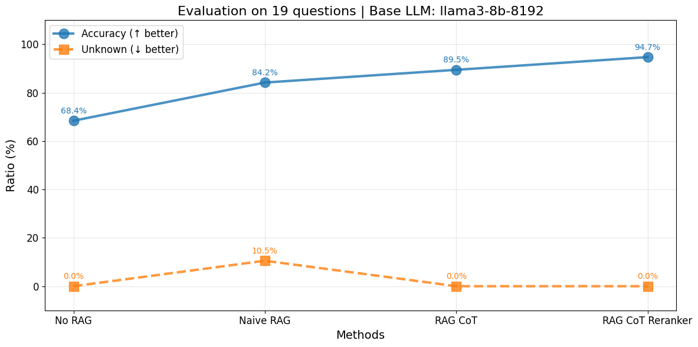

# Solution

This repository contains the implementation of an assistant  for the sagemaker documentation.

## Demo

<!-- <video width="800" controls>
  <source src="img/app.mp4" type="video/mp4">
  Your browser does not support the video tag.
</video> -->

[Watch the video](img/app.mp4)

## Approach

The following approach uses RAG + CoT + Reranker implemented with Langgraph.

```python
                   +-----------+          
                   | __start__ |          
                   +-----------+          
                         *                
                         *                
                         *                
                 +--------------+         
                 | check_misuse |         
                 +--------------+         
                 ...            ...       
               ..                  ..     
             ..                      ..   
+-------------------+                  .. 
| generate_response |                ..   
+-------------------+              ..     
                 ***            ...       
                    **        ..          
                      **    ..            
               +------------------+       
               | get_final_answer |       
               +------------------+       
                         *                
                         *                
                         *                
                    +---------+           
                    | __end__ |           
                    +---------+           

```

## Benchmark



## Files and Structure

- **thought_process.ipynb**: `It contains all the explanations. Please, look at the notebook for a detailed explanation`.
- **app.py**: GUI for the RAG system.
- **backend.py**: Backend that contains the graph and the logic for the RAG system.
- **qa_list.json**: Contains the initial ground truth list of questions and answers.
- **qa_list_answers_***: Answers for each approach (naive RAG, no RAG, RAG with chain-of-thought, and RAG with chain-of-thought and re-ranking).
- **qa_list_shuffled.json**: Shuffled list of questions and answers used as the ground truth testing dataset.


## Methodology 

### Setup and baseline

1. **Understand the Data**: All data are markdown files with mixed content types including explanations, JSON, YAML, etc.
2. **Baseline Solution**: Implemented a naive RAG approach to establish a baseline.
3. **Evaluation**: Created a `ground truth testing dataset` and used accuracy as the `evaluation metric`.

### Naive RAG implementation

- **Embedding Model**: Used HuggingFace's `BAAI/bge-small-en model` for creating embeddings.
- **Document Splitting**: Split documents into chunks of 1000 tokens with a 200-token overlap.
- **Vector Store**: Created a vector store using Chroma.

### Chain-of-Thought (CoT) 

- **System Prompt**: Developed a detailed system prompt to guide the model through a `chain-of-thought` process.
- **Improved Accuracy**: Observed significant improvement in accuracy with the chain-of-thought approach.

### Re-Ranking 

- **Cross-Encoder Reranker**: Implemented a reranker using HuggingFace's `BAAI/bge-reranker-base model`.
- **Contextual Compression Retriever**: Enhanced the retriever to use the reranker for better document relevance.

### Final Solution

- **Evaluation**: Achieved high accuracy with the combined `RAG + CoT + Reranker approach`.
- **Future Work**: Explore further enhancements such as reflection, hybrid search, graphrag and a custom `cognitive architecture for RAG`.

## How to run

1. **Install dependencies**: Ensure all necessary libraries are installed.
```sh
   pip install -r requirements.txt
   streamlit run app.py
```

## Disclaimer

- For a production-ready system, further testing and optimization are required.
- The system is designed for the Sagemaker documentation and may not generalize to other domains.
- The accuracy metric may not be representative of real-world performance.

## TODO

- create an docker image for the backend and the frontend.
- create an image for the vector store.
- create an image to deploy Ollama for offline inference.
- orchestrate the application using docker-compose.
